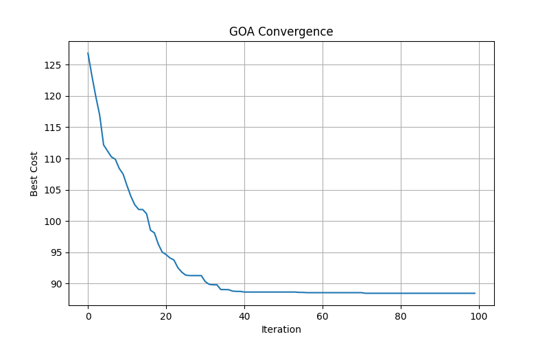
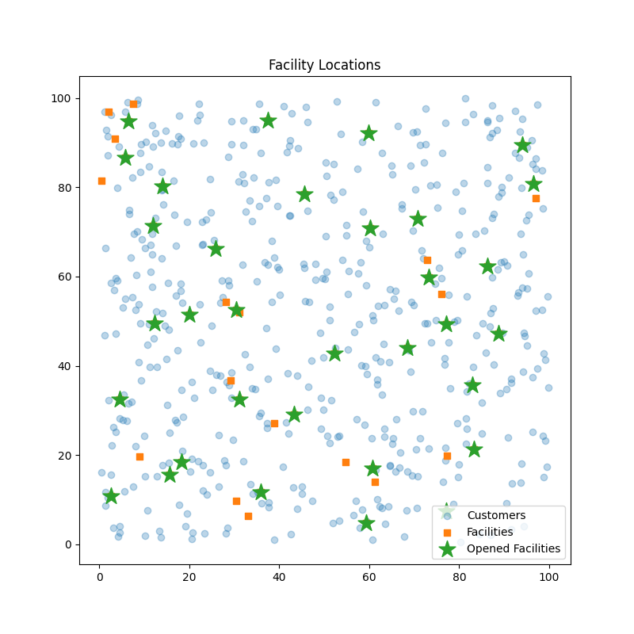

# Grasshopper Optimization Algorithm for the Uncapacitated Facility Location Problem (UFLP)

This project implements a Binary Grasshopper Optimization Algorithm (GOA) to solve the Uncapacitated Facility Location Problem (UFLP).

The objective is to determine which facilities should be opened in order to minimize the total cost consisting of:

- Facility opening costs
- Customer transportation costs

The implementation uses a binary representation of facility decisions and applies a sigmoid transfer function to convert continuous GOA updates into binary solutions.

---

## Problem Description

The Uncapacitated Facility Location Problem (UFLP) is a classical NP-hard optimization problem.

Given:

- A set of candidate facilities
- A set of customers
- Opening costs for facilities
- Distances between facilities and customers

The goal is to minimize:

```text
Total Cost =
Σ(i ∈ Opened) fi
+
Σ(j ∈ Customers) min(i ∈ Opened)(dij)
```

where:

- fi = opening cost of facility i
- dij = distance between facility i and customer j


---

## Grasshopper Optimization Algorithm (GOA)

GOA is a swarm-based metaheuristic inspired by the collective movement of grasshoppers.

Main features:

- Exploration and exploitation balance using adaptive parameter \(c\)
- Social interaction mechanism between grasshoppers
- Binary solution generation using a sigmoid transfer function
- Applicable to combinatorial optimization problems

---

## Parameters

| Parameter | Value |
|------------|--------|
| Facilities | 50 |
| Customers | 500 |
| Population Size | 30 |
| Iterations | 100 |
| Runs | 10 |
| c_max | 1.0 |
| c_min | 0.001 |
| f | 0.3 |
| l | 1.5 |

---

## Experimental Results

The algorithm was tested on a randomly generated UFLP instance.

| Metric | Value |
|----------|----------|
| Best Cost | 88.45 |
| Runtime | 1.34 sec |
| Opened Facilities | 33 |
| Greedy Cost | 88.64 |
| Greedy Opened Facilities | 35 |
| Improvement | 0.21% |
| Mean Cost (10 Runs) | 88.51 |
| Standard Deviation | 0.27 |
| Best Run | 88.31 |
| Worst Run | 89.04 |

---

## Convergence Curve



---

## Facility Locations



---

## Requirements

Install dependencies:

```bash
pip install numpy scipy matplotlib
```

---

## Run

```bash
python goa.py
```

---

## Report

A detailed project report is available in:

- Report.pdf

---

## Notes

This implementation is intended for educational and research purposes. The generated facility locations, customer locations, and opening costs are randomly created using a fixed random seed for reproducibility.

---

## License

MIT License
