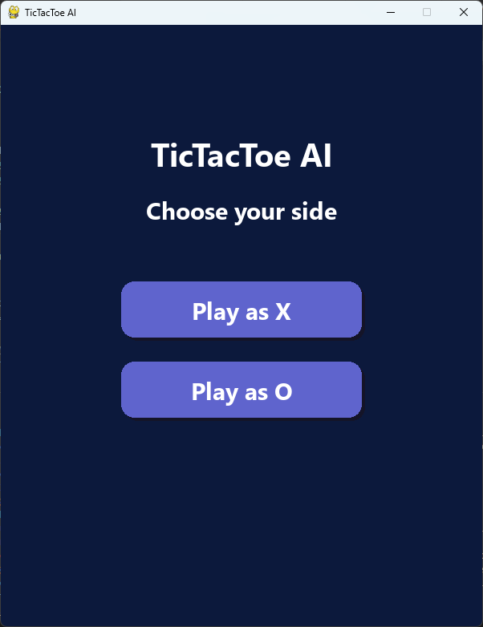
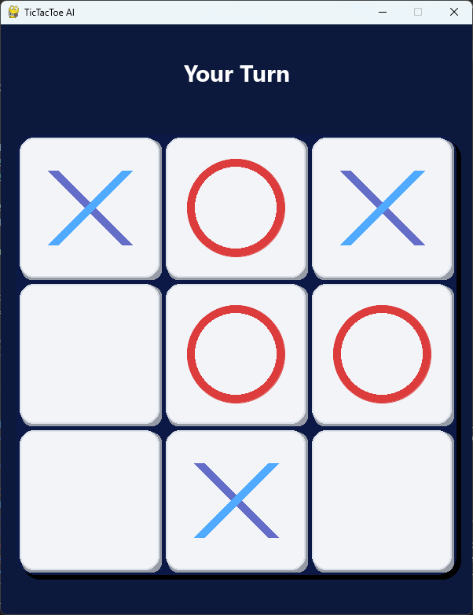
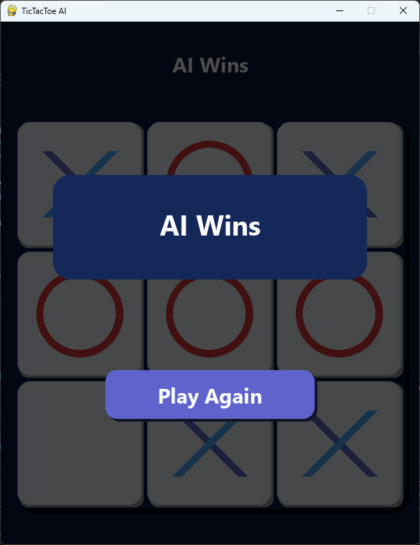

# Tic-Tac-Toe DQN

Deep Q-Network (DQN) implementation for Tic-Tac-Toe using PyTorch.

The project trains two independent agents:

- Player 1 (X) — always plays first
- Player 2 (O) — always plays second

Training uses:

- Double DQN
- Experience Replay
- Self-Play
- Minimax Curriculum Opponent
- Target Network Updates

---

## Features

- Human vs AI using Pygame
- AI vs AI evaluation
- AI vs Random evaluation
- Minimax-assisted curriculum training
- Separate models for X and O

---

## Screenshots

### Main Menu

<p align="center">

</p>

### Gameplay

<p align="center">

</p>

### Game Over

<p align="center">

</p>

---


## Installation

```bash
git clone https://github.com/vidasdti/tic-tac-toe-dqn.git

cd tic-tac-toe-dqn

pip install -r requirements.txt
```

## Training

Train Player 1 and Player 2:

```bash
python src/train.py
```

Generated models:

```text
models2/player1/best_model.pth
models2/player2/best_model.pth
```

---

## Play Against AI

```bash
python src/game_ui.py
```

Choose whether to play first or second.

---

## Evaluate Against Random

```bash
python src/ai_vs_random.py
```

Example result:

```text
Wins   : 9792
Losses : 26
Draws  : 182
Win Rate: 97.92%
```

---

## AI vs AI

```bash
python src/ai_vs_ai.py
```

Example:

```text
Player1 Wins : 0
Player2 Wins : 0
Draws : 1000
```

Two optimal agents generally draw every game.


---

## Technologies

- Python
- PyTorch
- NumPy
- Pygame

---

## License

MIT License
